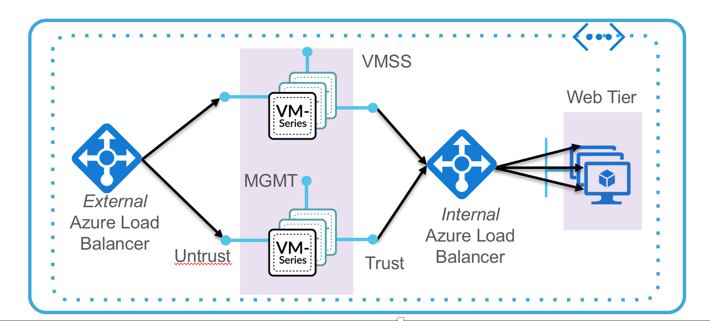

# azure-autoscaling
Azure autoscaling solution using VMSS and AppInsights

This is work in progress...

# Service principal needs to be owner or reader...contributor role will not work
# Supports PAYG bundle1/bundle2 only for now

## TO DO

 1. Use cosmos DB for storing the current fw instance list?
 
 2.Ask for Panorama IP and  push panorama ip to firewall or bootstrap (makes panorama mandatory)
   @Scale Out, store fw serial number
   @Scale In event, ask panorama to delicense the firewall that scaled in and delete from panorama
   
 3. Test scale in and out events along with ILB and web servers in back end.
 4. Export some arguments into main as env variables in start.sh? 
 
 5. Test to see what happens when (in azureDeploy.json) we set autoscale min to 1...does webhook get triggered?
     No webhook gets fired. Use nested deployment with depends on main template finish to set min to supplied min
     
 6. Add error checking
 
 7. Use Azure Python SDK? Makes things slightly easier...
    https://github.com/gbowerman/azurerm/tree/master/docs (get_vmss_nics)
    https://github.com/gbowerman/azurerm/blob/master/examples.md 
    
 9. Worker node HA? or use azure function to send msg to bus and then worker node gets the msg?
 
 10. Secure worker node as it has a public ip address....above method might resolve that issue

# Support Policy
This CFT is released under an as-is, best effort, support policy. These scripts should be seen as community supported and Palo Alto Networks will contribute our expertise as and when possible. We do not provide technical support or help in using or troubleshooting the components of the project through our normal support options such as Palo Alto Networks support teams, or ASC (Authorized Support Centers) partners and backline support options. The underlying product used (the VM-Series firewall) by the scripts or templates are still supported, but the support is only for the product functionality and not for help in deploying or using the template or script itself.
Unless explicitly tagged, all projects or work posted in our GitHub repository (at https://github.com/PaloAltoNetworks) or sites other than our official Downloads page on https://support.paloaltonetworks.com are provided under the best effort policy.
